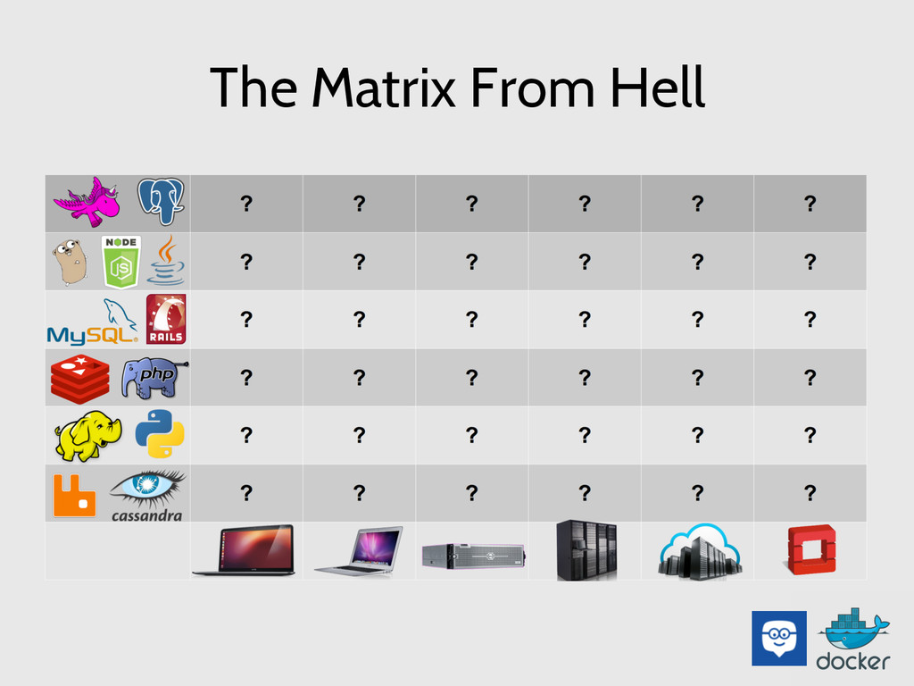

# Docker

Repositório de estudos do Docker, Docker Compose, Docker Swarm e Kubernetes (k8s)

## O que é Docker?

É um software que facilita o setup de aplicações, onde cada `container` possui configurações específicas de cada aplicação, independente de Sistema Operacional ou outro ambiente. Além disso, as tecnologias que utilizamos no Docker não precisam ser instaladas localmente no computador.

### Matrix from Hell

Imagine um cenário de 6 projetos em uma empresa, cada projeto com suas dependências e ambientes para execução. Como no exemplo abaixo.



Sem o Docker, é preciso configurar cada depenência separadamente para cada ambiente, uma tarefa que consome muito tempo para garantir que todas elas estejam rodando com as mesmas configurações. Além disso, é preciso ter muita resiliência para dar manutenção em todos os ambientes.

## Containers

É um pacote de código que pode executar uma ação, Ex: projeto Node, projeto PHP, projeto Python. Os containers utilizam imagens para serem executados.

Diferente de uma VM (Virtual Machine), um container possui apenas um fim, não tendo um sistema operacional dedicado todo para ele, o que acaba tornando ele leve, geralmente com alguns MBs, enquanto VMs possuem GBs.

### Executar um container

1. Dar `pull` no container

```bash
docker pull <imagem>
```

2. Executar o container

```bash
docker run <imagem>
```

3. Verificar se container está executando

```bash
docker ps
```

ou

```bash
docker container ls
```

> Para verificar todos os containers que já foram executados

```bash
docker ps -a
```

### Executar um container em modo iterativo

É quando o container fica executando em um terminal, permitindo executar comandos específicos dentro do container.

```bash
docker run -it <imagem>
```

### Executar um container em background (`detached`)

É quando o container roda em plano de fundo, não ocupando uma aba no terminal

```bash
docker run -d <imagem>
```

### Parar a execução de um container

```bash
docker stop <nome ou id do container>
```

### Reiniciar o container

O comando `docker stop` para os containers, mas ele ainda ficam listados no comando `docker ps -a`, assim podemos executar eles novamente.

```bash
docker start <id do container>
```

> O comando `docker run` CRIA UM NOVO CONTAINER.
> O comando `docker start` roda o container novamente com as mesmas configurações de quando o `docker run` foi executado a primeira vez

Também é possível reiniciar o container em modo iterativo

```bash
docker start -it <id do container>
```

### Expor uma porta de um container

O container do docker é ISOLADO, ou seja, NÃO TEM CONEXÃO COM O MUNDO EXTERNO. Para possibiiltar isso é preciso export alguma porta do container.

Ex: usando o `nginx` como servidor web

1. Baixar imagem do `nginx`

```bash
docker pull nginx:stable-perl 
```

2. Executar o container e expor uma porta

```bash
docker run -d -p 80:80 nginx:stable-perl 
```

> O primeiro 80 é a porta que será aberta para o navegador, para que possamos acessar e o segundo 80 é a porta que a a plicação aplicação expõe. Se fizermos `3000:80` é possível acessar a o servidor `nginx` em `localhost:3000`.

3. Entrar no servidor web `locahost:80`

### Definir um nome para o container

Caso não seja informado, um nome aleatório será atribuído ao container.

```bash
docker run --name <nome> <imagem>
```

### Acessar logs do container

```bash
docker logs <id ou nome do container>
```

> Para exibir logs em tempo real é possível adicionar a flag `-f` (follow)

```bash
docker logs -f <id ou nome do container>
```

### Remover container

```bash
docker rm <id ou nome do container>
```

> Se o container estiver rodando ainda é preciso usar a flag `-f` (force)

```bash
docker rm -f <id ou nome do container>
```

É possível também remover um container automaticamente após a execução dele

```bash
docker run --rm <id ou nome da imagem>
```

### Copiar arquivos dentro de um container

É possível copiar e colar arquivos entre uma máquina local e um container

```bash
docker cp <id ou nome do container>:/<diretório dentro do container para copiar> <diretório de destino>
```

### Processamento de um container

```bash
docker top <id ou nome do container>
```

### Verificar processos que estão sendo executados em um container

```bash
docker stats <id ou nome do container>
```

### Inspecionar um container

Exibe todas as configurações do container

```bash
docker inspect <id ou nome do container>
```

## Imagens

É o projeto que será executado pelo container, todas as instruções para rodar o container são feitas dentro de de um arquivo `Dockerfile` que é a imagem. Uma imagem pode levar como base uma imagem pronta.

Imagens prontas podem ser hospedadas no [DockerHub](https://hub.docker.com/).

### Criando arquivo `Dockerfile`

Utilizando um servidor `node` com `express` como exemplo:

1. Na raiz de um projeto criar um arquivo `Dockerfile`

```Dockerfile
FROM node:latest

WORKDIR /app

COPY package*.json .

RUN npm install

COPY . .

EXPOSE 3000

CMD ["node", "app.js"]
```

2. Fazer o `build` da imagem

```bash
docker build <diretorio da imagem>
```

3. Verificar se a imagem foi criada com sucesso

```bash
docker image ls
```

ou 

```bash
docker image ls
```

3. Copiar o id da imagem e executar o container

```bash
docker run -d -p 3000:3000 <id da imagem>
```

### Atualizando uma imagem no `Dockerfile`

Sempre o `Dockerfile` é alterado, é preciso executar o `build` novamente, pois para o Docker ela será é imagem completamente nova. Após isso é preciso executar o `docker run` com o novo id da imagem.

### Cache das camadas da imagem

Cada instrução dentro do `Dockerfile` é uma camada. Quando algo é atualizado, apenas as camadas abaixo da linha atualizada são refeitas, o restante permanece em cache.

### Renomear imagens

Sempre que uma imagem é gerada um nome anônimo é criado

```bash
docker tag <id da imagem> <nome>
```

ou

```bash
docker tag <id da imagem> <nome>:<tag> 
```

> Por default `:<tag>` é `:latest`

É possível também nomear atribuir um nome a imagem ao executar o build.

```bash
docker build -t <nome>:<tag> .
```

### Remover imagens

```bash
docker rmi <id ou nome da imagem>
```

ou para remover todas as imagens

```bash
docker rmi -f $(docker images -q)
```

### Remover tudo que não está sendo utilizado

Caso nenhum recurso do docker esteja sendo utilizado, como containers e imagens, é possível rodar o seguinte comando para remover todos:

```bash
docker system prune
```

## Volumes

Uma forma prática de persistir dados (fazer backup) em aplicações para não depender de um container (Todo dado criado em um container é salvo nele, quando ele é removido, todos os dados também são).

### Tipos de volume

- Anonymous: Volumes com nomes aleatórios (Criados com a flag `-v`)

```bash
docker run -v /<diretorio do volume anonimo>
```

Ex:

```bash
docker run -d -p 80:80 --name php-messages-container -v /data php-messages 
```

- Named: Volumes com nomes definidos

```bash
docker run -v <nome do volume>:/<diretorio do volume>
```

Ex:

```bash
docker run -d -p 80:80 --name php-messages-container -v php-volume:/var/www/html/messages --rm php-messages
```

> O diretório do volume precisa ser o mesmo do `WORKDIR` do `Dockerfile`

- Bind Mounts: Forma de salvar na máquina local, sem gerenciamento do docker.

```bash
docker run <diretorio da maquina local>:/<diretorio do volume>
```

Ex:

```bash
docker run -d -p 80:80 --name php-messages-container -v /Users/danielg.favero/Documents/estudos/docker/2-volumes/messages:/var/www/html/messages --rm php-messages
```

- Apenas para leitura: Nesse tipo de volume não é possível escrever nenhum arquivo

```bash
docker run <diretorio da maquina local>:/<diretorio do volume>:ro
```

> `:ro` é abreviação para *Read Only*

### Criar volume manualmente

É possível criar volume sem precisar rodar um container

```bash
docker volume create <nome do volume>
```

Posteriormente é possível atrelar esse volume a um container.

### Listar volumes

```bash
docker volume ls
```

### Inspecionando volume

```bash
docker volume inspect <nome do volume>
```

### Removendo volumes

```bash
docker volume rm <nome do volume>
```

> Remover um volume REMOVE TODOS OS DADOS dentro dele

É possível também remover todos os volumes não utilizados

```bash
docker volume prune
```

## Networks

É a forma gerenciar a conexão entre os containers do docker com outras plataformas ou até mesmo outros containers. Assim como os Volumes, eles são criados separados dos containers.

### Tipos de conexão

- Externa: Conexão com uma API ou servidor externo.
- Com o host: Comunicação do container com a máquina local.
- Entre containers: Comunicação que utiliza com um `driver` `bridge` para comunicar dois ou mais containers.

### Tipos de driver

- *Bridge*: É o default do Docker, utilizado quando dois ou mais containers precisam se conectar.
- *Host*: Permite conexão do container com a máquina local.
- *Macvlan*: Permite conexão a um container por meio de um endereço MAC.
- *None*: Remove todas as conexões de rede de um container.
- *Plugins*: Permite extensões para criar outras redes.

### Listar redes.

```bash
docker network ls
```

> Alguns networks são criados por padrão pelo Docker para sua configuração inicial.

```bash
NETWORK ID     NAME      DRIVER    SCOPE
da3c20a11139   bridge    bridge    local
d9b873f523c1   host      host      local
70f5a0873c36   none      null      local
```

### Criar rede

```bash
docker network create <nome da rede>
```

> Por padrão ela será do tipo `bridge`

Para criar com um driver específico:

```bash
docker network create -d macvlan <nome da rede>
```

### Remover rede

```bash
docker network rm <nome da rede>
```

Para remover todas as redes não utilizadas:

```bash
docker network prune
```

### Conectar um container a uma rede

Ao executar o container:

```bash
docker run --network <nome da rede>
```

Ou manualmente após a execução:

```bash
docker network connect <nome da rede> <nome do container>
```

### Desconectar um container

```bash
docker network disconnect <nome da rede> <nome do container>
```

### Inspecionar redes

```bash
docker network inspect <nome da rede>
```

## YAML

É uma linguagem utilizada para arquivos de configuração, principalmente para configurar o `docker compose`. São arquivos com extensão `.yml` ou `.yaml`.

### Estrutura de um arquivo `.yaml`

Assim como o `python` as instruções são identificadas por identações e espaços.

```yaml
# String
name: "Daniel"
last_name: Gustavo Favero # Não precis de aspas

# Integer
age: 24

# Float
currency: 150.4

# Boolean
is_admin: True    # True
is_customer: on   # True
is_visitor: False # False
is_guest: off     # False

# Null
first_null_value: null
second_null_value: ~

# Objects
first_object:
  version: 2
  file: "test.txt"
  nested:
    key: value

second_object: { version: 2,  file: "test.txt", nested: { key: value } }

# Lists
first_list: [1, 2, 3, 4, 5]
second_list:
  - "First"
  - 2
  - 3.0
  - True
```

## Docker Compose

É uma ferramenta para rodar múltiplos containers usando apenas um arquivo de configuração. É semelhante a criar um arquivo `Dockerfile`.

### Exemplo de arquivo compose para projeto Wordpress

```yaml
name: WordpressApp
services:
  db: # Container do MySQL
    container_name: MySQL
    image: mysql:8.0.43 # FROM mysql:8.0.43
    command: mysqld --default_authentication_plugin=mysql_native_password
    environment:
      TZ: America/Sao_Paulo
      MYSQL_ROOT_PASSWORD: docker
      MYSQL_USER: docker
      MYSQL_PASSWORD: docker
      MYSQL_DATABASE: wordpress
    ports:
      - 3308:3306
    networks:
      - wordpress-network

  wordpress: # Container do Wordpress
    container_name: Wordpress
    depends_on: # Quais serviços o container depende (ele só vai executar esse serviço após essa lista ser executada)
      - db
    image: wordpress:latest
    volumes:
      - ./config/php.conf.uploads.ini:/usr/local/etc/php/conf.d/uploads.ini
      - ./wp-app:/var/www/html
    environment:
      TZ: America/Sao_Paulo
      WORDPRESS_DB_HOST: db
      WORDPRESS_DB_NAME: wordpress
      WORDPRESS_DB_USER: root
      WORDPRESS_DB_PASSWORD: docker
    ports:
      - 80:80
    networks:
      - wordpress-network

networks:
    wordpress-network:
      driver: bridge
```

### Executar um arquivo `docker-compose.yaml`

```bash
docker-compose up
```

ou para executar em background

```bash
docker-compose up -d
```

### Parar compose

```bash
docker-compose down
```

### Variáveis de ambiente no compose

Para inserir variáveis de ambiente em um arquivo `docker-compose.yaml`:

1. Criar um arquivo `.env`

```.env
ENV_1=1
ENV_2=2
...
```

2. Atualizar arquivo `docker-compose.yaml`:

```yaml
# ...
services:
  # ...
  service-1:
    # ...
    env_file:
      - ./.env
    # ...
```

### Redes no compose

Por padrão o docker compose cria uma rede com driver `bridge`. Mas é possível isolar redes.

```yaml
# ...
services:
  # ...
  service-1:
    # ...
    networks:
      - network-name

# ...
networks:
    # ...
    network-name:
      driver: bridge
    # ...
```

### Executar build de imagens ao executar o compose

É preciso informar o caminho do `Dockerfile` para que seja executado o build. Nesse caso não é necessário informar a chave `image`.

```yaml
# ...
services:
  # ...
  service-1:
    # ...
    build: <caminho-para-o-dockerfile>
```

### Bind mount no compose

Para fazer alterações no projeto e persistir as alterações nos containers.

```yaml
services:
  # ...
  service-1:
    # ...
    volumes:
      - <caminho-onde-o-bind-mount-vai-monitorar-para-verificar-alteracoes>
```

### Verificação do compose

```bash
docker-compose ps
```

## Orquestração de containers

É o ato de conseguir **gerenciar e escalar** containers de uma aplicação. Geralmente se opta por uma arquitetura horizontal, onde pequenas máquinas ficam responsáveis por dar vazão e distribuição dos containers para os usuários. Nessa arquitetura há uma serviço que rege todos os outros.

Alguns serviços que realizam orquestração: *Docker Swarm*, *Kubernetes*, etc.

## Docker Swarm

É uma ferramenta do Docker para orquestrar containers de forma horizontal. Os comandos são muito semelhantes aos do Docker. Por padrão, o Docker já vem com o Swarm, porém desabilitado.

### Conceitos fundamentais

- **Nodes**: é uma instância que participa do Swarm;
- **Manager Node**: node que gerencia os demais nodes;
- **Worker Node**: node que trabalha em função do manager;
- **Service**: Um conjunto de tarefas que o **Manager Node** manda para o **Worker Node** executar;
- **Task**: Comandos que são executados nos Nodes.

### Iniciando o Swarm

```bash
docker swarm init
```

> Rodar esse comando tornará a máquina um `node` e o transformará em `manager`

### Listar nodes

```bash
docker node ls
```

### Adicionar nodes

```bash
docker swarm join --token <token do node><ip>:<porta>
```

> Esse `node` já entra no swarm como `worker`
> Ao rodar `docker swarm init` o comando de `join` já é apresentado para conectar os `nodes`

### Subir um serviço (container) no Swarm

```bash
docker service create --name <nome do servico> -p <porta da aplicacao> <imagem>
```

> Isso inicia o serviço em apenas uma máquina

### Listar serviços no Swarm

```bash
docker service ls
```

> Apenas o `node` `manager` tem acesso a essa informação

### Remover serviço

```bash
docker service rm <nome ou id do serviço>
```

### Replicando serviços

É definido na hora da criação do serviço

```bash
docker service create --name <nome do servico> -p <porta da aplicacao> --replicas <numero de replicas> <imagem>
```

Isso irá emitir uma task que irá replicar o serviço nos `workers`.

> Remover um container de um `worker` faz o swarm atualizar e iniciar novamente de forma automatica o serviço naquele `worker`

### Recuperar token do manager

Recuperar o comando de join do `node` `manager`.

```bash
docker swarm join-token manager
```

### Verificar informações do Swarm

```bash
docker info
```

### Sair do Swarm

```bash
docker swarm leave 
```

Ou para sair de um `node` `manager`

```bash
docker swarm leave -f 
```

> O node apenas sai do Swarm, mas ele continua executando.

### Remover um node

```bash
docker node rm <id do node>
```

> Caso esteja rodando um serviço, é preciso usar a flag `-f`

### Inspecionar serviços

```bash
docker service inspect <id do serviço>
```

### Verificar containers rodando

```bash
docker service ps <id do serviço>
```

> É semelhante ao `docker ps -a`
> Ele mostra informações de que `nodes` estão executando o serviço

### Executando Compose no Swarm

```bash
docker stack deploy -c <arquivo do compose> <nome>
```

### Aumentar réplicas do Stack

```bash
docker service scale <nome do serviço> = <numero de replicas>
```

### Limitar um serviço a não receber mais tasks

```bash
docker node update --availability drain <id do node>
```

### Atualizar configurações de um node

```bash
docker service update --<propriedade> <novo valor da propriedade> <id do serviço>
```

Ex 1: Alterando imagem do serviço

```bash
docker service update --image <id da imagem> <id do serviço>
```

Ex 2: Alterando rede do serviço

```bash
docker service update --network <id da rede> <id do serviço>
```

> Apenas os nodes com status `ACTIVE` receberão essa atualização

### Criar redes no Swarm

```bash
docker network create --driver overlay <nome da rede>
```

> Entra máquinas o driver que precisa ser utilizado é o `overlay`

### Contectar um serviço a uma rede

```bash
docker service update --image <id da imagem> <id do serviço>
```
